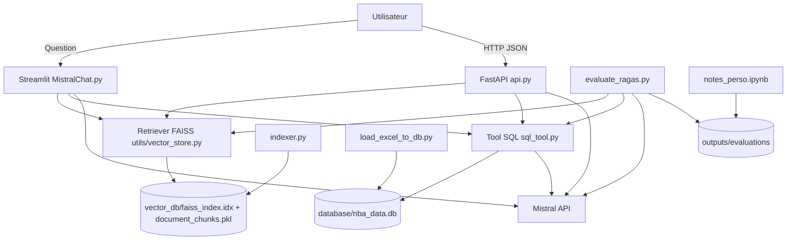

# Rapport technique - système RAG NBA (Mistral + FAISS + SQL)

Ce dépôt contient le prototype RAG demandé dans la mission, avec :
- un assistant Streamlit,
- une API REST versionnée,
- un pipeline d'ingestion Excel vers SQLite,
- un Tool SQL LangChain,
- un script d'évaluation RAGAS,
- un notebook de rapport d'évaluation.

## 1. État réel du repo et livrables
Ce README reflète le dépôt réel (pas de modules fantômes).

Modules **présents** :
- `MistralChat.py`
- `api.py`
- `indexer.py`
- `load_excel_to_db.py`
- `sql_tool.py`
- `evaluate_ragas.py`
- `notes_perso.ipynb`
- `utils/config.py`, `utils/vector_store.py`, `utils/data_loader.py`

Modules **absents** (et donc non documentés comme actifs) :
- `utils/database.py`
- `utils/query_classifier.py`

## 2. Schéma d'architecture


## 3. Prérequis
- Python 3.9+
- Clé API Mistral valide
- Environnement virtuel recommandé

## 4. Installation
```bash
python -m venv .venv
source .venv/bin/activate
python -m pip install --upgrade pip
python -m pip install -r requirements.txt
```

Créer un `.env` à la racine :
```bash
MISTRAL_API_KEY=your_key_here
```

## 5. Données d'entrée
Données attendues (selon mission) :
- Excel : `inputs/regular NBA.xlsx` (ou `matchs/regular+NBA.xlsx`)
- PDFs Reddit : `inputs/Reddit 1.pdf` ... `inputs/Reddit 4.pdf`

## 6. Scripts livrés et rôle
### `indexer.py`
- Construit l'index vectoriel FAISS à partir des documents du dossier `inputs/`.
- Produit `vector_db/faiss_index.idx` + `vector_db/document_chunks.pkl`.

### `load_excel_to_db.py`
- Lit l'Excel NBA.
- Valide les lignes avec Pydantic.
- Alimente SQLite : `players`, `matches`, `stats`.
- Alimente `reports` à partir des PDFs Reddit (texte extractible ou fallback explicite si non extractible).

### `sql_tool.py`
- Tool SQL LangChain (`StructuredTool`).
- Génération SQL dynamique (few-shot + schéma DB).
- Exécution SQL en lecture seule.
- Routage outillé via `answer_question_sql_via_langchain`.

### `MistralChat.py`
- Interface Streamlit.
- Pipeline RAG + SQL pour répondre aux questions utilisateurs.

### `api.py`
- API REST FastAPI versionnée.
- Expose le même pipeline RAG + SQL que l'app Streamlit.

### `evaluate_ragas.py`
- Évaluation automatisée RAGAS (profil core).
- Génère :
  - `outputs/evaluations/samples_*.json`
  - `outputs/evaluations/ragas_summary_*.json`
  - `outputs/evaluations/ragas_details_*.csv`

### `notes_perso.ipynb`
- Rapport d'analyse méthodologique.
- Inclut comparatifs avant/après et visualisations.

## 7. Usage de la base SQLite
Fichier DB : `database/nba_data.db`

Tables principales :
- `players`: stats agrégées joueur (points, % tirs, rebonds, etc.)
- `matches`: agrégats équipe (code, nom, points totaux, bilan)
- `stats`: métriques normalisées par clé (`stat_key`, `stat_value`)
- `reports`: contenu textuel Reddit (ou marqueur explicite si PDF non extractible)

Flux d'écriture/lecture :
- **Écriture**: `load_excel_to_db.py`
- **Lecture SQL**: `sql_tool.py`
- **Lecture indirecte dans les réponses**: `MistralChat.py`, `api.py`, `evaluate_ragas.py`

## 8. API REST versionnée
Lancer l'API :
```bash
python -m uvicorn api:app --reload --port 8000
```

Docs OpenAPI :
- `http://localhost:8000/docs`
- `http://localhost:8000/redoc`

### Endpoints v1 (cibles)
- `GET /api/v1/health`
- `POST /api/v1/ask`

### Endpoints legacy (compatibilité, dépréciés)
- `GET /health`
- `POST /ask`

### Format requête `/api/v1/ask`
```json
{
  "question": "Entre OKC et MIA, quelle équipe a le plus de points totaux ?",
  "k": 5
}
```

### Format réponse `/api/v1/ask`
```json
{
  "question": "...",
  "answer": "...",
  "retrieval_count": 5,
  "contexts": [
    {
      "text": "...",
      "score": 0.0,
      "metadata": {"source": "..."}
    }
  ],
  "sql_status": "ok",
  "sql_query": "SELECT ...",
  "sql_rows": [{"team_code": "OKC", "team_points_total": 9880}],
  "latency_retrieval_s": 0.12,
  "latency_generation_s": 0.45,
  "latency_total_s": 0.72
}
```

### Exemple `curl`
```bash
curl -X POST "http://localhost:8000/api/v1/ask" \
  -H "Content-Type: application/json" \
  -d '{"question":"Entre OKC et MIA, quelle équipe a le plus de points totaux ?","k":5}'
```

## 9. Exécution de bout en bout
```bash
# 1) Construire l'index vectoriel
python indexer.py

# 2) Charger la base SQL
python load_excel_to_db.py

# 3) Lancer l'interface Streamlit
python -m streamlit run MistralChat.py

# 4) Lancer l'API REST
python -m uvicorn api:app --reload --port 8000

# 5) Lancer l'évaluation
python evaluate_ragas.py
```

## 10. Évaluation et rapport
Artefacts d'évaluation : `outputs/evaluations/`
- `samples_*.json`
- `ragas_summary_*.json`
- `ragas_details_*.csv`

Rapport d'analyse : `notes_perso.ipynb`

## 11. Limites connues
- Les erreurs API Mistral (ex. 429) peuvent dégrader les scores d'évaluation.
- Les PDF Reddit peuvent être image-only ; l'extraction texte dépend de la disponibilité OCR.
- Les métriques automatiques RAGAS ne remplacent pas une validation humaine métier.
